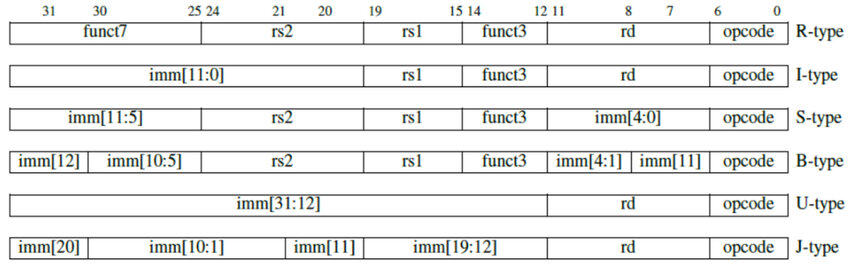

# Instruction Memory

Welcome to the Instruction Memory module of this RISC-V processor project. This component is responsible for storing and providing instructions to the CPU during execution. Below, you'll find an overview of the instruction memory's functionality, development process, and theoretical background.

## Overview
The instruction memory is a crucial element in the CPU architecture, holding the program's instructions and supplying them to the CPU as directed by the program counter. It ensures that the CPU has access to the correct instructions for execution.

## Functionality
- **Instruction Storage:** Contains a predefined set of instructions stored in memory.
- **Instruction Fetch:** Provides the current instruction based on the program counter's address.
- **Reset:** Can reset the output instruction to zero, ensuring a known state.

## Development Process

### Design
<div style="max-width: 800px; overflow-x: auto;">
    
```VHDL
library IEEE;
use IEEE.STD_LOGIC_1164.ALL;
use IEEE.NUMERIC_STD.ALL;

entity instruction_memory is
    port ( 
        pc : in STD_LOGIC_VECTOR(11 downto 0);  -- input from program counter
        instruction : out STD_LOGIC_VECTOR(31 downto 0)
    );
end instruction_memory;

architecture Behavioral of instruction_memory is
    type memory_array is array (0 to 4095) of STD_LOGIC_VECTOR(31 downto 0);
    constant instruction_memory : memory_array := (
        0      => x"00000093", -- addi x1, x0, 0
        1      => x"00100113", -- addi x2, x0, 1
        2      => x"00000213", -- addi x4, x0, 0
        3      => x"00B00293", -- addi x5, x0, 11
        4      => x"00428763", -- beq x4, x5, 7
        5      => x"002081B3", -- add x3, x1, x2
        6      => x"00010093", -- addi x1, x2, 0
        7      => x"00018113", -- addi x2, x3, 0
        8      => x"0001807F", -- prnt x3
        9      => x"00120213", -- addi x4, x4, 1
        10     => x"FE000AE3", -- beq x0, x0, -6, wrap around
        11     => x"0001807F", -- prnt x3
        12     => x"FE000FE3", -- beq x0, x0, -1
        others => x"00000000"
    );

begin
    instruction <= instruction_memory(to_integer(unsigned(pc)));
end Behavioral;
```

### Testing
Here, I've provided the test bench to test the module.

```VHDL
library IEEE;
use IEEE.STD_LOGIC_1164.ALL;
use IEEE.NUMERIC_STD.ALL;

entity instruction_memory_tb is
end instruction_memory_tb;

architecture Behavioral of instruction_memory_tb is
  -- define the component under test
  component instruction_memory
    port (
      pc : in STD_LOGIC_VECTOR(31 downto 0);
      instruction : out STD_LOGIC_VECTOR(31 downto 0)
    );
  end component;

  -- define all intermediary signals here
  signal pc : STD_LOGIC_VECTOR(31 downto 0);
  signal instruction : STD_LOGIC_VECTOR(31 downto 0);

  -- start simulation here
begin
  -- instantiate the unit under test
  uut : instruction_memory
    port map (
      pc => pc,
      instruction => instruction
    );

  -- simulate process
  stimulus: process
  begin

    -- Test instruction fetch
    pc <= x"00000000";
    wait for 10 ns;
    assert (instruction = x"00400093") report "Instruction fetch failed at address 0" severity error;

    pc <= x"00000004";
    wait for 10 ns;
    assert (instruction = x"00800113") report "Instruction fetch failed at address 4" severity error;

    pc <= x"00000008";
    wait for 10 ns;
    assert (instruction = x"00A00193") report "Instruction fetch failed at address 8" severity error;

    -- End simulation
    wait;
  end process stimulus;

end Behavioral;
```

Here's the provided waveform of the simulation to prove its correctness:

If you want to see how I derived the binary instructions for the CPU, you can refer to here and the RISC-V instruction format.

```C
// Simple C program to print out the Fibonacci sequence
int main() {
    int a = 0;
    int b = 1;
    int fib = 0;

    for (int i = 0; i < 11; i++) {
        fib = a + b;
        a = b;
        b = fib;
        printf("%d\n", fib);
    }

    return 0;
}
```

Referring to the ISA for this CPU implementation, I have the following instructions:

```asm
; define x0 as the zero register  
; define x1 as the first Fibonacci number (a)
; define x2 as the second Fibonacci number (b)  
; define x3 as the temp printed value (fib)
; define x4 as i
; define x5 as limit of loop
0.  addi x1, x0, 0   ; a = 0
1.  addi x2, x0, 1   ; b = 1  
2.  addi x4, x0, 0   ; i = 0
3.  addi x5, x0, 10  ; loop limit = 10
4.  beq x4, x5, 7    ; if i == 11, goto infinite loop
5.  add x3, x1, x2   ; fib = a + b
6.  addi x1, x2, 0   ; a = b
7.  addi x2, x3, 0   ; b = fib  
8.  prnt x3          ; print fib
9.  addi x4, x4, 1   ; i++
10. beq x0, x0, -6   ; goto loop condition check
11. prnt x3          ; print last Fibonacci number
12. beq x0, x0, -1   ; infinite loop printing last value
```
<br>
<br>

<p align="center">
    
</p>
<p align="center">
    <em>Instruction Format of RISC-V instructions.</em>
</p>

Now, if we convert them to the 32-bit binary instructions referring to the instruction format of RISC-V (and nmy custom print function), we'll get:

```
0.  000000000000_00000_000_00001_0010011  -- addi x1, x0, 0

1.  000000000001_00000_000_00010_0010011  -- addi x2, x0, 1

2.  000000000000_00000_000_00100_0010011  -- addi x4, x0, 0

3.  000000001011_00000_000_00101_0010011  -- addi x5, x0, 11

4.  0000000_00101_00100_000_01110_1100011 -- beq x4, x5, 7

5.  0000000_00010_00001_000_00011_0110011 -- add x3, x1, x2

6.  000000000000_00010_000_00001_0010011  -- addi x1, x2, 0

7.  000000000000_00011_000_00010_0010011  -- addi x2, x3, 0

8.  000000000000_00011_000_00000_1111111  -- prnt x3

9.  000000000001_00100_000_00100_0010011  -- addi x4, x4, 1

10. 1111111_00000_00000_000_11010_1100011 -- beq x0, x0, -6

11. 000000000000_00011_000_00000_1111111  -- prnt x3

12. 1111111_00000_00000_000_11111_1100011 -- beq x0, x0, -1  

```

Finalized Hexadecimal Instructions for Compactness:
```
0      => x"00000093", -- addi x1, x0, 0

1      => x"00100113", -- addi x2, x0, 1

2      => x"00000213", -- addi x4, x0, 0

3      => x"00B00293", -- addi x5, x0, 11

4      => x"00520763", -- beq x4, x5, 7

5      => x"002081B3", -- add x3, x1, x2

6      => x"00010093", -- addi x1, x2, 0

7      => x"00018113", -- addi x2, x3, 0

8      => x"0001807F", -- prnt x3

9      => x"00120213", -- addi x4, x4, 1

10     => x"FE000AE3", -- beq x0, x0, -6, wrap around

11     => x"0001807F", -- prnt x3

12     => x"FE000FE3", -- beq x0, x0, -1

```

## Theoretical Background
### Purpose
The instruction memory is essential for storing the program's instructions and supplying them to the CPU for execution. By maintaining a set of instructions, it ensures that the CPU can perform operations as intended.

### Operations
- Fetch: Retrieves the current instruction based on the program counter's address.
- Reset: Ensures a known state by resetting the output instruction.

## Importance
An efficient instruction memory design is crucial for optimizing CPU performance, as it directly impacts the speed and accuracy of instruction execution. This README provides a structured overview of the instruction memory component, highlighting its role and functionality within the CPU architecture.
