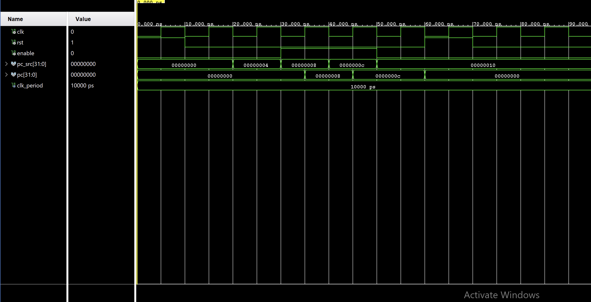

# Program Counter

Welcome to the Program Counter module of this RISC-V processor project. This component is responsible for tracking the current instruction address during CPU operations. Below, you'll find an overview of the program counter's functionality, development process, and theoretical background.

## 🧠 Overview
The program counter is a crucial element in the CPU architecture, responsible for maintaining the address of the current instruction being executed. It ensures the sequential flow of instruction execution by incrementing the address after each instruction cycle.

## ⚙️ Functionality
- **Address Storage:** Holds the address of the current instruction in bytes.
- **Increment:** Automatically increments by 4 after each instruction, pointing to the next instruction.
- **Reset:** Can be reset to a specific address, typically the start of the program.

## ✍ Development Process

### Design
<div style="max-width: 800px; overflow-x: auto;">
    
```VHDL
library IEEE;
use IEEE.STD_LOGIC_1164.ALL;
use IEEE.NUMERIC_STD.ALL;

entity program_counter is
    port (
        clk : in STD_LOGIC;
        rst : in STD_LOGIC;
        enable : in STD_LOGIC;  
        pc_src : in STD_LOGIC_VECTOR(31 downto 0);
        pc : out STD_LOGIC_VECTOR(31 downto 0)
    );
end program_counter;

architecture Behavioral of program_counter is
    signal pc_reg : STD_LOGIC_VECTOR(31 downto 0) := (others => '0');
begin
    process(clk, rst)
    begin
        if rst = '1' then
            pc_reg <= (others => '0');
        elsif rising_edge(clk) then
            if enable = '1' then  -- only update when enabled
                pc_reg <= pc_src;
            end if;
        end if;
    end process;
    
    pc <= pc_reg;
end Behavioral;
```
</div>
Generally speaking, the increment for a program counter is always 4 bytes since every instruction is 32 bits long. However, since the instruction memory module uses an array with each entry being a STD_LOGIC_VECTOR with a width of 32 bits, this is not necessary but useful to keep in mind.

### Testing
Here's the test bench for our program ocunter to ensure correctness and ideal behavior.

```VHDL
library IEEE;
use IEEE.STD_LOGIC_1164.ALL;
use IEEE.NUMERIC_STD.ALL;

entity program_counter_tb is
end program_counter_tb;

architecture Behavioral of program_counter_tb is
    -- declare components here
    component program_counter
        port (
            clk : in STD_LOGIC;
            rst : in STD_LOGIC;
            enable : in STD_LOGIC;
            pc_src : in STD_LOGIC_VECTOR(31 downto 0);
            pc : out STD_LOGIC_VECTOR(31 downto 0)
        );
    end component;

    -- internal signals for testing program counter functionality
    signal clk : STD_LOGIC := '0';
    signal rst : STD_LOGIC := '0';
    signal enable : STD_LOGIC := '0';
    signal pc_src : STD_LOGIC_VECTOR(31 downto 0) := (others => '0');
    signal pc : STD_LOGIC_VECTOR(31 downto 0);

    -- defined clock period
    constant clk_period : time := 10 ns;

begin
    -- instantiate unit under test
    uut: program_counter
        port map (
            clk => clk,
            rst => rst,
            enable => enable,
            pc_src => pc_src,
            pc => pc
        );

    -- clock generation process
    clk_process: process
    begin
        while true loop
            clk <= '0';
            wait for clk_period / 2;
            clk <= '1';
            wait for clk_period / 2;
        end loop;
    end process;

    -- test simulation here
    stimulus: process
    begin
        -- apply reset and allow reset to take effect so that outputs are defined
        rst <= '1';
        wait for clk_period;
        rst <= '0';
        wait for clk_period;

        -- test case #1: Set PC to 0x00000004
        pc_src <= x"00000004";
        wait for clk_period;
        assert (pc = x"00000000") report "PC update failed at 4" severity error; -- since enable is low

        -- test case #2: Set PC to 0x00000008 and enable high
        enable <= '1';
        pc_src <= x"00000008";
        wait for clk_period;
        assert (pc = x"00000008") report "PC update failed at 8" severity error;

        -- test case #3: Set PC to 0x0000000C
        pc_src <= x"0000000C";
        wait for clk_period;
        assert (pc = x"0000000C") report "PC update failed at C" severity error;

        -- last test case: set enable to 0 again, then try updating PC
        enable <= '0';
        pc_src <= x"00000010";
        wait for clk_period;
        assert (pc = x"0000000C") report "PC update failed at C" severity error; -- should hold onto last PC

        -- test case #4: Reset again and check PC returns to zero
        rst <= '1';
        wait for clk_period;
        assert (pc = x"00000000") report "PC reset failed" severity error;
        rst <= '0';
        wait for clk_period;

        wait;
    end process;
end Behavioral;
```

Here are the waveforms on Vivado to show proof of correctness.
<p align="center">
    
</p>

<p align="center">
  <em>
    Figure 1: Simulation waveform showing that the program counter behaves as expected — 
    the PC updates to pc_src on rising clock edges and resets correctly when rst is high. 
  </em>  
</p>

## 💡 Theoretical Background

### Purpose
The program counter is essential for controlling the flow of instruction execution in the CPU. By maintaining and updating the instruction address, it ensures that the CPU processes instructions in the correct sequence.

### Operations
- Increment: Automatically advances to the next instruction address after each cycle.
- Reset: Can be set to a specific address to start execution from a new point, useful for program initialization or branching.

## 🔑 Importance
An efficient program counter design is crucial for optimizing CPU performance, as it directly impacts the control flow and execution speed of instructions.

