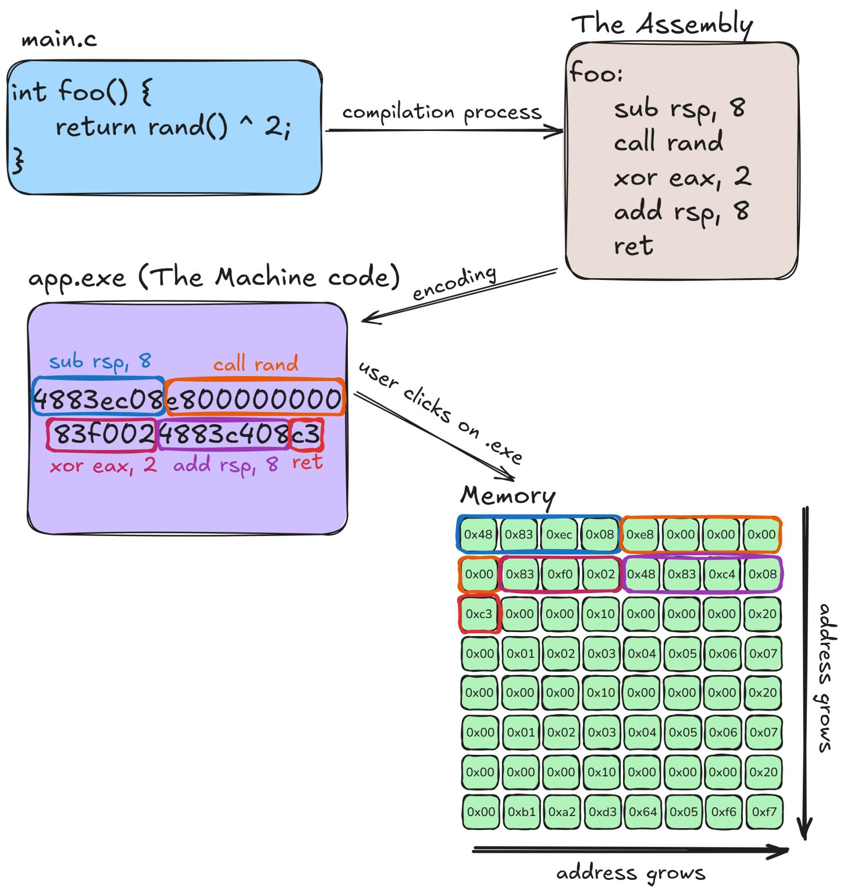

# MIPS-CPU FPGA Implementation using VHDL Overview
After taking a computer architecture course at Case Western, I was inspired to design and implement a processor based on the MIPS architecture. This project is divided into two main components: software (compiler/assembler + UART communication) and hardware (CPU implementation on FPGA).

## Software Approach
The software component consists of a compiler that translates simplified C-style code such as:
```c
int a = 5; 
int b = 3; 
int c = a + b; 
printf(c, %d); 
```

into 32-bit MIPS machine instructions. These instructions are then transmitted from my Mac to the FPGA over UART using the Python pyserial library.
Each 32-bit instruction is divided into four 8-bit packets (bytes) for serial transmission.

## Hardware Approach
The hardware component includes:
- A UART receiver that collects incoming 8-bit packets and reconstructs them into 32-bit instructions.
- An instruction memory (RAM) that stores the uploaded program.
- A MIPS-compatible CPU written in VHDL, which begins execution once all instructions are received. </br>
</br>
The CPU follows the standard instruction cycle: fetch → decode → execute → memory access → write-back, and interacts with RAM to store computation results.

## Compiler Design
<figure>
  
  <figcaption>Credit goes to Arseny Morozov for this picture.</figcaption>
</figure>


## CPU Architecture Design

## Experiment

## Deliverables
