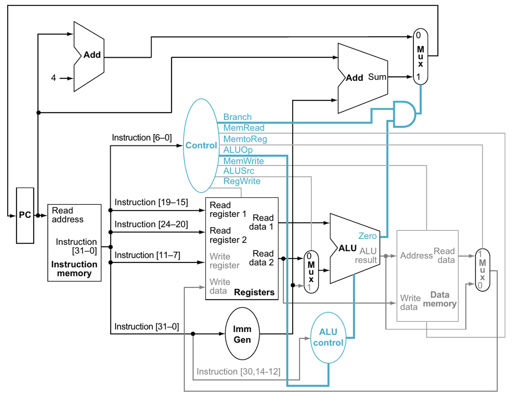

# RISC-V CPU FPGA Implementation using VHDL Overview
Welcome to the RISC-V CPU FPGA Implementation project! Inspired by my computer architecture course at Case Western, this project aims to design and implement a processor based on the RISC-V architecture using VHDL.

## Overview 
This project involves creating a RISC-V compatible CPU on an FPGA, focusing on the hardware components and CPU architecture. The CPU follows the standard instruction cycle: fetch → decode → execute → memory access → write-back, interacting with RAM to store computation results.

## CPU Architecture Theory


### Instruction Memory
The instruction memory is crucial for loading instructions onto the FPGA via UART. It works in tandem with a receiver that writes to memory whenever the valid flag is asserted. The program counter (PC) reads the address of the instruction, which is then pipelined into the instruction register and control unit.

### Register File
The register file consists of 32 registers, each 32 bits wide. It uses a 5-bit standard logic vector to index the registers and includes:
- Two read addresses
- A write enable input
- A write address
- A 32-bit wide read value

### Program Counter
The program counter is a register that stores the current instruction address (in bytes) and increments by 4 once the instruction has been completed in the CPU.

### Control Unit
The control unit processes the instruction fetched from the instruction memory and sends out the appropriate control flags to the rest of the CPU. This includes ALU opcodes, writing to the appropriate registers, and reading from the correct memory address.

### Immediate Generator
The immediate generator takes in the instruction as a separate unit and derives the immediate from checking the opcode of the instruction. There's a multiplexer where the output of this gets passed through, which is allowed to propagate based on appropriate control signals from the control unit.

### Arithmetic Logic Unit
The ALU performs all mathematical computations within the CPU, including addition, subtraction, bitwise operations, and more.

### Datapath
The datapath takes the results from the ALU and control flags to determine where to write back to the register files, completing the CPU execution cycle.

## Software Implementation
Eventually, the goal is to take any simple C code (for the video demo we'll use the following provided C code) and convert it to the 32-bit instructions necessary for the CPU to perform calculations.

```C
int main() {
   int a = 0;
   int b = 1;
   int sum = 1;

   for (int i = 0; i < 10; i++) {
      sum = a + b;
      a = b;
      b = sum;
      printf("%d\n", sum);
   }
   return 0;
}
```
--- 

Please go into each subproject folder to see more in detail.
