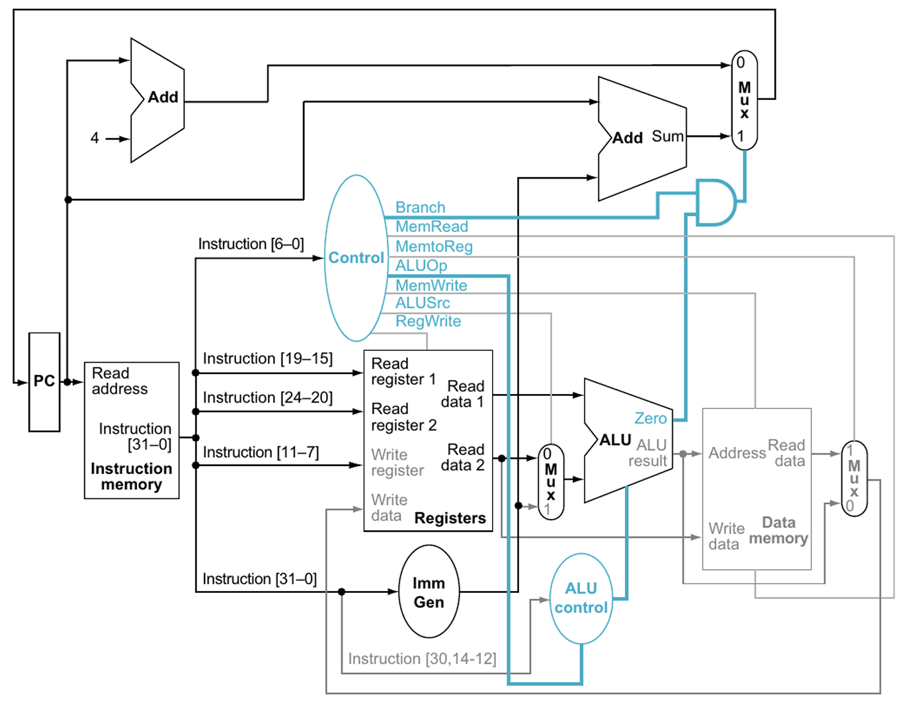

# RISC-V Processor

Welcome to the top-level `RISC-V processor` module of this RISC-V CPU project. This module brings together all critical components—control logic, arithmetic units, memory, and I/O—to form a fully functioning single-cycle RISC-V CPU. It is designed with modularity, clarity, and debugging features in mind.

## 🧠 Overview
The RISC-V processor module acts as the central hub for instruction execution. It connects submodules such as the program counter, control unit, ALU, register file, and data memory to process instructions based on the RISC-V ISA. It also integrates a seven-segment display and LED-based debugging support for observing runtime values like instruction count and printf outputs.

## ⚙️ Functionality

- **Instruction Execution**: Orchestrates instruction fetch, decode, execute, memory access, and write-back.
- **PC Control**: Uses a clock divider to slow execution for step-by-step debugging.
- **Branching & Jumping**: Supports branching logic through multiplexers and control signals.
- **Memory Access**: Interfaces with instruction and data memory modules.
- **Display Output**: Shows memory-mapped printf-style output on a 7-segment display.
- **Instruction Count Debugging**: Uses 16 on-board LEDs to show number of executed instructions.

## 🧪 Testing

Simulation and hardware debugging strategies:

- Preload instructions into memory.
- Use waveform viewer in Vivado to observe PC, ALU, and register values.
- Monitor:
  - PC and instruction progression.
  - LED display for instruction counter.
  - 7-segment output for printf values (`0xFFFF0000` address).

When deployed on hardware, the 1 Hz slow clock allows visual step-by-step execution of instructions using visible LEDs and 7-segment display output.

### Block Diagram



### Design
<div style="max-width: 800px; overflow-x: auto;">
    
```VHDL
library IEEE;
use IEEE.STD_LOGIC_1164.ALL;
use IEEE.NUMERIC_STD.ALL;

entity riscv_processor is
    port ( 
        clk : in STD_LOGIC;
        rst : in STD_LOGIC;
        seg : out STD_LOGIC_VECTOR (6 downto 0);
        ade : out STD_LOGIC_VECTOR (3 downto 0);
        led : out STD_LOGIC_VECTOR (15 downto 0)
    );
end riscv_processor;

architecture Behavioral of riscv_processor is
    -- component declarations
    
    component adder is
        port (
            op1 : in STD_LOGIC_VECTOR(31 downto 0);
            op2 : in STD_LOGIC_VECTOR(31 downto 0);
            sum : out STD_LOGIC_VECTOR(31 downto 0)
        );
    end component;
    
    component mux is
        port (
            input1 : in STD_LOGIC_VECTOR(31 downto 0);
            input2 : in STD_LOGIC_VECTOR(31 downto 0);
            sel : in STD_LOGIC;
            mux : out STD_LOGIC_VECTOR(31 downto 0)
        );
    end component;
    
    component program_counter is
        port (
            clk : in STD_LOGIC;
            rst : in STD_LOGIC;
            pc_src : in STD_LOGIC_VECTOR(31 downto 0);
            pc : out STD_LOGIC_VECTOR(31 downto 0)
        );
    end component;
    
    component instruction_memory is
        port (
            pc : in STD_LOGIC_VECTOR(31 downto 0);
            instruction : out STD_LOGIC_VECTOR(31 downto 0)
        );
    end component;
    
    component register_file is
        port (
            clk : in STD_LOGIC;
            rst : in STD_LOGIC;
            read_addr1 : in STD_LOGIC_VECTOR(4 downto 0);
            read_addr2 : in STD_LOGIC_VECTOR(4 downto 0);
            write_addr : in STD_LOGIC_VECTOR(4 downto 0);
            write_data : in STD_LOGIC_VECTOR(31 downto 0);
            reg_write : in STD_LOGIC;
            read_data1 : out STD_LOGIC_VECTOR(31 downto 0);
            read_data2 : out STD_LOGIC_VECTOR(31 downto 0)
        );
    end component;
    
    component immediate_generator is
        port (
            instruction : in STD_LOGIC_VECTOR(31 downto 0);
            immediate : out STD_LOGIC_VECTOR(31 downto 0)
        );
    end component;
    
    component control_unit is
        port (
            opcode : in STD_LOGIC_VECTOR(6 downto 0);
            funct3 : in STD_LOGIC_VECTOR(2 downto 0);
            funct7 : in STD_LOGIC_VECTOR(6 downto 0);
            RegWrite : out STD_LOGIC;
            MemRead : out STD_LOGIC;
            MemWrite : out STD_LOGIC;
            BranchEq : out STD_LOGIC;
            memToReg : out STD_LOGIC;
            AluSrc : out STD_LOGIC;
            ALUCont : out STD_LOGIC_VECTOR(2 downto 0);
            jmp : out STD_LOGIC
        );
    end component;
    
    component alu is
        port (
            op1 : in STD_LOGIC_VECTOR(31 downto 0);
            op2 : in STD_LOGIC_VECTOR(31 downto 0);
            opcode : in STD_LOGIC_VECTOR(2 downto 0);
            res : out STD_LOGIC_VECTOR(31 downto 0);
            zero_flag : out STD_LOGIC
        );
    end component;
    
    component data_memory is
        port (
            clk : in STD_LOGIC;
            rst : in STD_LOGIC;
            address : in STD_LOGIC_VECTOR(31 downto 0);
            write_data : in STD_LOGIC_VECTOR(31 downto 0);
            mem_write : in STD_LOGIC;
            mem_read : in STD_LOGIC;
            read_data : out STD_LOGIC_VECTOR(31 downto 0)
        );
    end component;
    
    component seven_seg_mux is
        port (
            clk : in STD_LOGIC;
            rst : in STD_LOGIC;
            val : in STD_LOGIC_VECTOR(15 downto 0);  
            seg : out STD_LOGIC_VECTOR(6 downto 0);  
            ade : out STD_LOGIC_VECTOR(3 downto 0)   
        );
    end component;
    
    -- internal signals
    signal pc_clk : STD_LOGIC := '0';
    signal pc_src_i : STD_LOGIC_VECTOR(31 downto 0);
    signal pc_i : STD_LOGIC_VECTOR(31 downto 0);
    signal pc_next : STD_LOGIC_VECTOR(31 downto 0);
    signal branch_target : STD_LOGIC_VECTOR(31 downto 0);
    
    signal curr_inst : STD_LOGIC_VECTOR(31 downto 0);
    signal immediate_i : STD_LOGIC_VECTOR(31 downto 0);
    signal write_data_i, read_data1_i, read_data2_i : STD_LOGIC_VECTOR(31 downto 0);
    
    signal cu_regwrite, memread_i, memwrite_i, brancheq_i, memtoreg_i, alusrc_i, jmp_i : STD_LOGIC;
    signal alucont_i : STD_LOGIC_VECTOR(2 downto 0);
    signal alu_op2 : STD_LOGIC_VECTOR(31 downto 0);
    signal res_i : STD_LOGIC_VECTOR(31 downto 0);
    signal zero_flag_i : STD_LOGIC;  
    signal branch_taken : STD_LOGIC;
    
    signal dm_read_data : STD_LOGIC_VECTOR(31 downto 0);
    
    -- printf detection signals
    signal printf_detected : STD_LOGIC;
    signal printf_value : STD_LOGIC_VECTOR(15 downto 0);
    signal instruction_counter : STD_LOGIC_VECTOR(15 downto 0) := (others => '0');
    
    -- memory-mapped I/O address for printf
    constant PRINTF_ADDR : STD_LOGIC_VECTOR(31 downto 0) := X"FFFF0000";

begin
    -- clock divider for slower PC operation (1 Hz for debugging)
    clk_divider : process(clk, rst) 
        variable clk_cnt : integer range 0 to 50_000_000 := 0;
    begin
        if rst = '1' then
            clk_cnt := 0;
            pc_clk <= '0';
        elsif rising_edge(clk) then
            if clk_cnt = 50_000_000 then  
                clk_cnt := 0;
                pc_clk <= not pc_clk;
            else
                clk_cnt := clk_cnt + 1;
            end if;
        end if;
    end process clk_divider;
    
    -- instruction counter for LED display
    process(pc_clk, rst)
    begin
        if rst = '1' then
            instruction_counter <= (others => '0');
        elsif rising_edge(pc_clk) then
            instruction_counter <= std_logic_vector(unsigned(instruction_counter) + 1);
        end if;
    end process;
    
    -- printf detection logic
    process(clk, rst)
    begin
        if rst = '1' then
            printf_detected <= '0';
            printf_value <= (others => '0');
        elsif rising_edge(clk) then
            if memwrite_i = '1' and res_i = PRINTF_ADDR then
                printf_detected <= '1';
                printf_value <= read_data2_i(15 downto 0);
            else
                printf_detected <= '0';
            end if;
        end if;
    end process;
    
    -- component instantiations
    
    PC_ADDER : adder
        port map (
            op1 => pc_i,
            op2 => X"00000001",  
            sum => pc_next
        );
    
    BRANCH_ADDER : adder
        port map (
            op1 => pc_i,
            op2 => immediate_i,
            sum => branch_target
        );
    
    PC_MUX : mux
        port map (
            input1 => pc_next,
            input2 => branch_target,
            sel => branch_taken,
            mux_output => pc_src_i
        );
    
    PC : program_counter 
        port map (
            clk => pc_clk,
            rst => rst,
            pc_src => pc_src_i,
            pc => pc_i
        );
        
    IM : instruction_memory
        port map (
            pc => pc_i,
            instruction => curr_inst
        );
        
    RF : register_file
        port map (
            clk => clk,
            rst => rst,
            read_addr1 => curr_inst(19 downto 15),
            read_addr2 => curr_inst(24 downto 20),
            write_addr => curr_inst(11 downto 7),
            write_data => write_data_i,
            reg_write => cu_regwrite,  
            read_data1 => read_data1_i,
            read_data2 => read_data2_i
        );
    
    IG : immediate_generator 
        port map (
            instruction => curr_inst,
            immediate => immediate_i
        );
        
    CU : control_unit
        port map (
            opcode => curr_inst(6 downto 0),
            funct3 => curr_inst(14 downto 12),
            funct7 => curr_inst(31 downto 25),
            RegWrite => cu_regwrite,
            MemRead => memread_i,
            MemWrite => memwrite_i,
            BranchEq => brancheq_i,
            memToReg => memtoreg_i,
            ALUSrc => alusrc_i,
            ALUCont => alucont_i,
            jmp => jmp_i
        );
    
    ALU_MUX : mux
        port map (
            input1 => read_data2_i,
            input2 => immediate_i,
            sel => alusrc_i,
            mux_output => alu_op2
        );
        
    ALU_INST : alu 
        port map (
            op1 => read_data1_i,
            op2 => alu_op2,
            opcode => alucont_i,
            res => res_i,
            zero_flag => zero_flag_i
        );
        
    DM : data_memory 
        port map (
            clk => clk,
            rst => rst,
            address => res_i,
            write_data => read_data2_i,
            mem_write => memwrite_i,
            mem_read => memread_i,
            read_data => dm_read_data
        );
    
    WB_MUX : mux
        port map (
            input1 => res_i,
            input2 => dm_read_data,
            sel => memtoreg_i,
            mux_output => write_data_i
        );
    
    DISPLAY : seven_seg_mux
        port map (
            clk => clk,
            rst => rst,
            val => printf_value,
            seg => seg,
            ade => ade
        );
    
    -- combinational logic
    branch_taken <= brancheq_i and zero_flag_i;
    
    -- LED output shows instruction counter
    led <= instruction_counter;

end Behavioral;
```

### Memory-Mapped I/O and Assembly
Writing to the address 0xFFFF0000 triggers a display update on the 7-segment. This mimics a simplified printf() behavior. The goal is to eventually take assembly code like this and convert it into our 32-bit instructions by referring to our ISA.

```asm
.data
fib_sequence: .space 40  

.text
.globl main

main:
    li $t0, 0          # (first Fibonacci number)
    li $t1, 1          # (second Fibonacci number)
    la $t2, fib_sequence # move address of fib_sequence into $t2

    sw $t0, 0($t2)     # store x0 at fib_sequence[0]
    sw $t1, 4($t2)     # store x1 at fib_sequence[1]

    li $t3, 2          # initialize to 2 (next index in sequence)

loop:
    beq $t3, 10, end   # if counter = 10, exit loop

    # find next fib number
    add $t4, $t0, $t1  # $t4 = x0 + x1

    # store the result in the array
    sw $t4, 0($t2)     # Store $t4 at fib_sequence[$t3]

    # update x0 and x1 for next iteration
    move $t0, $t1      # $t0 = $t1
    move $t1, $t4      # $t1 = $t4

    # increment the counter and array index
    addi $t3, $t3, 1   # $t3 = $t3 + 1
    addi $t2, $t2, 4  

    j loop            

end:
    # 
    li $v0, 10         # load exit syscall code
    syscall            
```

If you translate that into the 32-bit binary instructions, you'll get:

```

```

## 💡 Importance
This top-level module:

- Integrates and coordinates the entire RISC-V CPU pipeline.

- Provides observable hardware debugging tools.

- Enables hands-on education in ISA-level design and hardware-software integration.

- Serves as a template for expanding the CPU with pipelining, caching, or interrupt handling.

## 🛠️ Requirements
- Vivado or compatible VHDL toolchain

- Basys 3 FPGA (or compatible board with 7-seg and LED output)

- Simulation testbench files

- Instruction binary for loading into memory

## Video Demo

Here, I've provided a working demo of the RISC-V processor handling the following assembly file. I want the FPGA board to "print" the first ten Fibonacci numbers.

